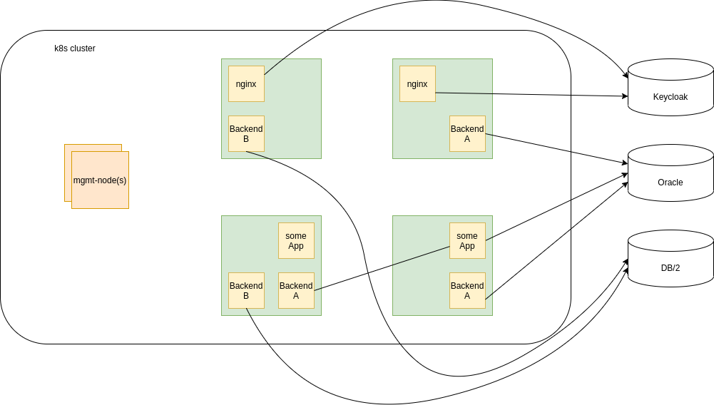

# Was sind health- und readiness-Probes?

Werden in einem kubernetes-Cluster verwendet um den Management-Nodes die Möglicheit zu geben auf Missstände im Cluster zu reagieren.

Beispielbild:

- kubernetes-Cluster mit 4 Worker-Nodes (grün)
- 4 verschiedene Anwendungen (nginx, Backend A, Backend B, some App), verschieden skaliert
- 3 Cluster-Externe Abhängigkeiten (Keycloak, Oralce, DB/2)
- Natürlich sind auch Cluster-Interene Abhängigkeiten vorstellbar

Aufgabe von kubernetes (die Software auf den Management-Nodes) ist nun: Alle Container in einem `working`-State zu halten.

## readiness
k8s prüft ob ein Container "ready" ist (readinessprobe).
- Wenn dies der Fall ist, dann wird er ins Loadbalancing aufgenommen und bekommt Anfragen.
- Wenn nicht, dann wird er aus dem Loadbalancing genommen. Nichts weiter!

## liveness
k8s prüft ob ein Container "live" ist (livenessprobe)
- Wenn dies der Fall ist passiert nichts
- Ist ein Container nicht live, so beendet Kubernetes diesen und startet ihn auf einem anderen Worker neu

# Diskussion:
Welche Szenarion sollten auf welche Probe Auswirkungen haben?